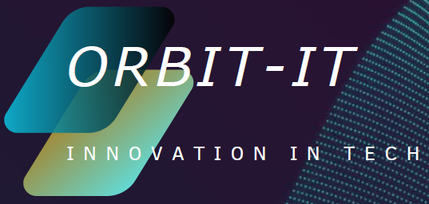
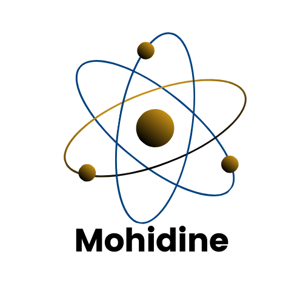
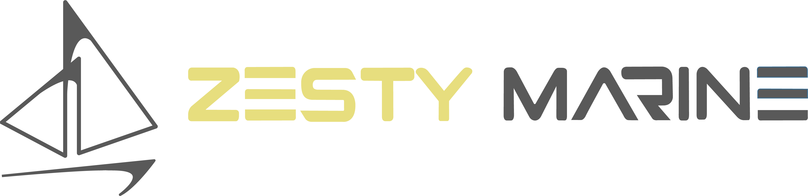
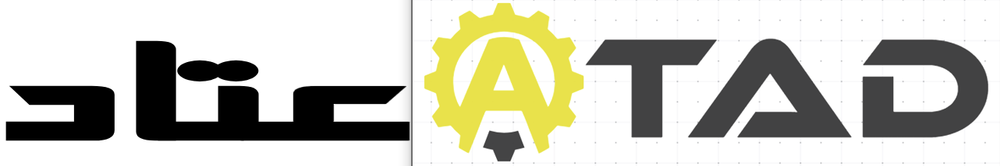

# Orbit-it

## Présentation de l'entreprise

     <!-- Remplacez par le chemin de votre image -->

**Orbit-it** est une entreprise innovante spécialisée dans la recherche et le développement, ainsi que dans le développement de solutions logicielles pour le web et le mobile. Notre mission est de créer des applications performantes et intuitives qui répondent aux besoins de nos clients et améliorent leur expérience utilisateur. Nous nous engageons à utiliser les dernières technologies et pratiques de développement pour garantir des produits de haute qualité.

## Projets en Cours

### 1. [Mohidine](lien_vers_le_projet)

     <!-- Remplacez par le chemin de votre image -->

Le projet **Mohidine** s'inspire des travaux du savant **Cheikh Mouhidine Samba Diallo** et vise à optimiser les algorithmes de la **Théorie de la Fonctionnelle de la Densité (DFT)** en intégrant des techniques d'intelligence artificielle. Ce projet est actuellement en cours de recherche et développement et est conçu pour répondre aux besoins des chercheurs en physique des matériaux.

#### Objectifs du Projet
- **Amélioration des Algorithmes DFT :** Utilisation de l'intelligence artificielle pour affiner les calculs de DFT, rendant les simulations plus précises et plus rapides.
- **Modélisation Avancée :** Développement d'outils de simulation pour modéliser le transport d'énergie et les propriétés des matériaux dans divers domaines, y compris l'électronique, la nanotechnologie et la science des matériaux.
- **Collaboration Interdisciplinaire :** Encourager les partenariats avec des institutions académiques et des laboratoires de recherche pour valider et appliquer les résultats du projet.

### Applications Pratiques
Le logiciel **Mohidine** sera un outil précieux pour les chercheurs, leur permettant de simuler et d'analyser des phénomènes complexes liés à la structure et aux propriétés des matériaux, tout en optimisant les performances des systèmes énergétiques.

## Nos Services

- **Recherche et Développement :** Exploration de nouvelles technologies et méthodes pour résoudre des problèmes complexes dans divers domaines, en mettant l'accent sur l'innovation.
  
- **Développement Web :** Création de sites web dynamiques et responsives utilisant les technologies les plus récentes comme React, Angular, et Node.js.
  
- **Développement Mobile :** Conception d'applications mobiles pour iOS et Android, en utilisant des frameworks comme React Native et Flutter pour garantir une expérience utilisateur optimale.

- **Intelligence Artificielle :** Intégration de solutions d'intelligence artificielle pour améliorer les performances des applications et offrir des fonctionnalités avancées, notamment dans le domaine de la modélisation et de l'analyse de données.

## Ils nous font confiance

    <a href="https://www.zesty-marine.com" target="_blank"  </a>
    
    
    
    <!-- Ajoutez d'autres logos ici -->

## Contribuer à Orbit-it

Nous encourageons les contributions de la communauté pour améliorer nos projets et créer des solutions innovantes. Si vous souhaitez contribuer, veuillez nous contacter par mail : [contact@orbit-it.io](mailto:contact@orbit-it.io) ou par WhatsApp : +216 53 866 594.
