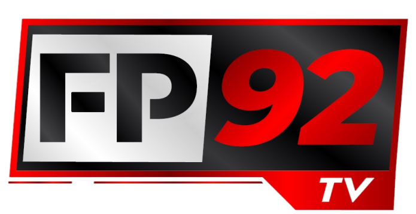

# Serigne Mansour Diop

Welcome to my GitHub! I am a passionate developer with expertise in creating custom applications, integrating tailored solutions, and optimizing processes. Below are some of my key projects and skills:

---

## 🌟 Key Projects

---

## 💼 Skills & Expertise

### **Programming Languages**
- **C++**: Development of Warehouse Control Systems (WCS) for automated equipment and custom integrations with ERP systems.
- **Python**: Backend development with **Django** for scalable web applications and APIs.
- **JavaScript**: Expertise in **React**, **React Native**, and **Node.js** for dynamic web and mobile applications.

### **Industrial Communication**
- **ModbusTCP**: Experience in implementing communication protocols for industrial automation and system monitoring.

### **Web Development**
- Full-stack development with **Django**, **React**, and RESTful APIs.
- Custom UI/UX design for seamless user experiences.

### **Process Optimization**
- Integration of ERP systems with tailored solutions to optimize workflows and productivity in manufacturing environments.

---

## 📫 Get in Touch
- **Email**: mansourdiop0011@gmail.com
- **Whatsapp**: +216 53 866 594
- **Startup Website**: https://www.orbit-it.io

---

## 🌱 Always Learning
I am constantly enhancing my knowledge in:
- **Advanced Python** for AI/ML solutions.
- **Real-time Industrial Communication** for IoT and smart factories.
- **System Optimization** to boost performance in logistics and automation.

*Thank you for visiting my GitHub profile and exploring my projects!*

